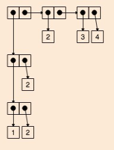

# Writing a tiny Scheme parser in Javascript

If you start your computer science degree at the University of Applied Sciences in Würzburg, one of the first lectures you’ll attend is an algorithms class, which is closely modelled after the infamous [Structure and Interpretation of Computer Programms](https://sarabander.github.io/sicp/). <br><br>
I already got my feet wet with JavaScript programming and liked its functional roots. No wonder I felt inclined to learn Scheme, the language it was [heavily inspired by](http://speakingjs.com/es5/ch04.html). <br>
 The whole course was truly a joyful and enlightening experience and one year later I applied to be a teaching assistant for this exact lecture. I wanted to share the insights and fun I had and help those who missed their ```Java.wayOfCoding()```.

## ... but why build a parser?

After an introduction to the basics of the language and the principles of iterative and recursive procedures you learn about pairs, a simple yet powerful datastructure with which you can build structures like lists and trees. You can read more about pair in the [corresponding seciont of SICP](https://sarabander.github.io/sicp/html/2_002e2.xhtml#g_t2_002e2). 

As a student you have to know how to assemble those complex data structures by using ```cons``` and ```list``` functions, as it is also tested in computer-based exams. Let's say you have the following structure:



You could construct it via ```(cons (cons (cons 1 2) 2) (cons 2 (cons 3 4)))```. If you then want to compare your solution and evaluate it in the REPL, you get ```'(((1 . 2) . 2) 2 3 . 4)``` back. As you can see, it can be quite tricky to compare the evaluation result to your input and the given picture of a structure. 

To help with that, I built a [conslist](https://mrvary.github.io/conslist/), a tiny tool that parses your code and displays what you’ve tried to build. Everything happens in the browser, so it’s a frontend only application. Let me show you how I built it.

## Parse all the data - part 1

Basically there are only two things to do here: first parse Scheme code into a suitable representation and then put that through some kind of drawing logic. <br>

I decided to directly map Scheme pairs to Javascript arrays, so ```(cons 1 2)``` would becomee ```[1, 2]```, something like ```(cons 1 (cons 2 3))``` turns into ```[1, [2, 3]]``` and ```nil``` is represented by ```[]```. My drawing logic could then recursively traverse the arrays, check the current element and draw a number or pair respectively.

It is pretty much the hackiest solution I could come up with, but it oh well, simply replacing ```(cons``` with ```[```, ```)``` with ```]``` and finally passing the result string into JavaScripts ```eval()``` function did the trick. 

Does it work? Sure. Should you do this at home? [Probably not...](https://developer.mozilla.org/de/docs/Web/JavaScript/Reference/Global_Objects/eval#Don't_use_eval_needlessly!)

## Draw things

Although everything could have been done via the canvas API, I went with [p5js](https://p5js.org/), a port of [Processing](https://processing.org/) to JavaScript. I enjoyed using it before and I wanted to get things done rather quickly.

Most of the drawing logic is rather trivial, so I won't go into any details. Basically I created a pair abstraction that encapsulates the position and content of each pair and provides the drawing functionality.

## Parse all the data - part 2

So how can we step up from replacing tokens in a string? Luckily I was attending a course on theoretical computer science and learning about grammars and state machines. There is pretty much a JavaScript library for everything, so I started looking if I could pimp my parsing logic and stumbled upon [PEG.js - a Parser Generator for JavaScript](https://pegjs.org/). 

You can try out everything [online](https://pegjs.org/online), so I built a context free grammar for the tiny part of Scheme that I needed. It looks like this:

```Javascript
Term
  = _ "(" _ "cons" _ car:Argument _ cdr:Argument _ ")" _
      { return [car, cdr] }
  / "(" _ "list" arguments: ( _ Argument )+ ")"
      {
      let values = [];

      arguments.forEach(function (el) {
          values.push(el[1]);
      });

      let f = function(array) {
          if (array.length === 1) {
              return [array[0],[]];
          } else {
              return [array[0], f(array.slice(1))]
          }
      }

      return f(values);
    }

Argument
  = Term
  / Integer
  / Nil

Nil "nil"
  = "nil" { return [] }
  / "'()" { return [] }

Integer "integer"
  = [0-9]+ { return parseInt(text(), 10); }

_ "whitespace"
  = [ \t\n\r]*
```

The great thing about peg.js is, that you can specify what JavaScript each token is supposed to return. On top of that it has decent and helpful Error messages. If you happen to forget a bracket, you don't end up with a messed up drawing but a nice ```uncaught exception: SyntaxError: Expected ")" but "2" found```.

## Closing thoughts

It was fun to connect different areas of my studies and build something that might actually be useful to some people. Of course there is still [room for improvement](https://github.com/mrvary/conslist/issues), but so far I'm pleased how it turned out. 😊

